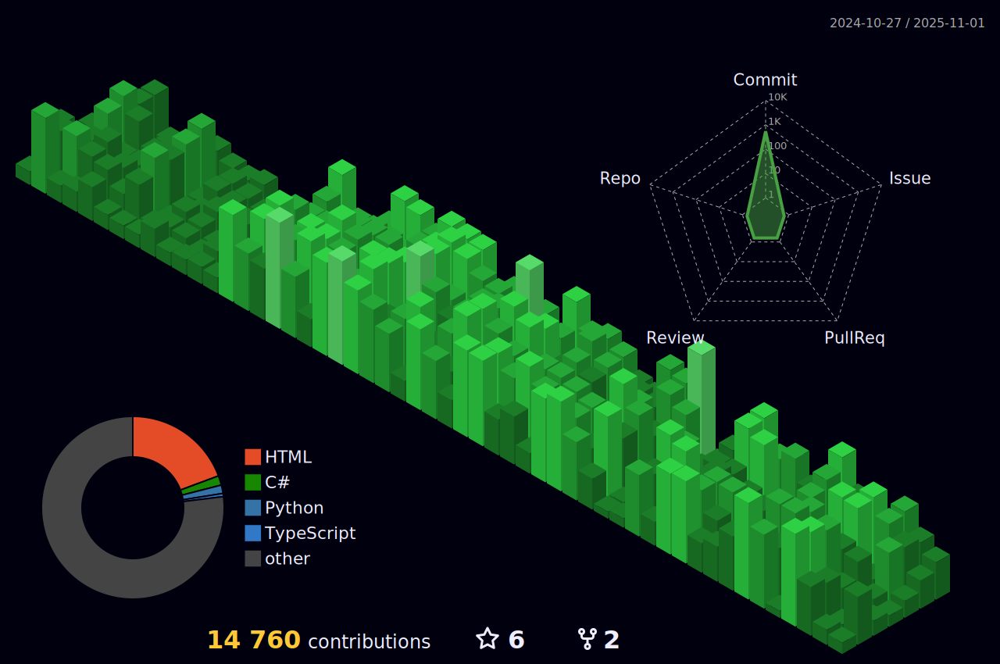

<a href="#">
  

  

     
    
    
  

   
   

  

    

      <a href="#">
      
      
      
      
      
      
      
      
      
      
      
      
      
      </a>
    

  

</a>

 
 

  

    
  

